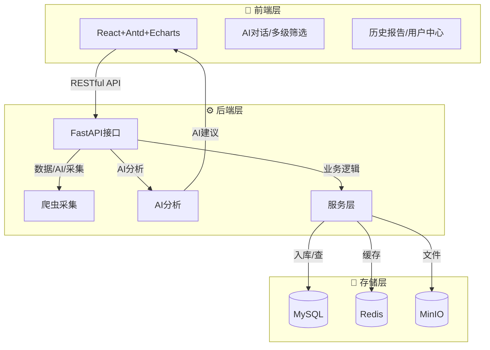
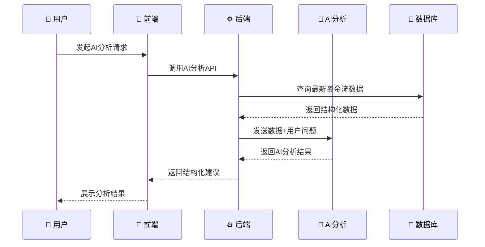

# 💹 金融智能数据采集与分析平台

<div align="center">


**🚀 企业级金融数据智能分析平台**  
**📊 数据采集 + AI分析 + 可视化展示 + 权限管理**

[](https://github.com/your-repo/financial-program/stargazers)
[](https://github.com/your-repo/financial-program/network)
[](https://github.com/your-repo/financial-program/issues)
[](https://github.com/your-repo/financial-program/blob/main/LICENSE)

</div>

---

## 📋 目录

- [🎯 项目简介](#项目简介)
- [🏗️ 系统架构与技术栈](#系统架构与技术栈)
- [✨ 核心功能](#核心功能)
- [📁 目录结构](#目录结构)
- [⚙️ 环境变量与配置](#环境变量与配置)
- [🚀 部署与启动](#部署与启动)
- [🔧 常见问题与运维](#常见问题与运维)
- [🤝 贡献与支持](#贡献与支持)

---

## 🎯 项目简介

本平台是一套面向企业级金融数据需求的全流程解决方案，集成了**自动化数据采集**、**结构化存储**、**AI智能分析**、**可视化展示**和**权限管理**等功能。支持多市场、多周期、多分类的资金流数据采集，结合大模型AI分析，为投资决策和数据洞察提供强大支撑。

## 🏗️ 系统架构与技术栈

### 技术栈详细介绍

#### 🎨 前端技术栈
- **React 18**：最流行的前端框架，组件化开发，生态丰富，适合构建大型应用
- **TypeScript**：JavaScript的超集，提供类型安全，减少运行时错误，提升开发效率
- **Ant Design**：企业级UI组件库，设计规范统一，组件丰富，开箱即用
- **Echarts**：百度开源的数据可视化库，图表类型丰富，性能优秀，适合金融数据展示
- **Vite**：现代前端构建工具，开发体验优秀，热更新快速

#### ⚙️ 后端技术栈
- **FastAPI**：高性能Python Web框架，自动生成API文档，异步支持，语法简洁易学
- **SQLAlchemy**：Python最流行的ORM框架，支持多种数据库，SQL构建灵活
- **Pydantic**：数据验证和序列化库，与FastAPI完美集成，类型安全
- **Uvicorn**：ASGI服务器，支持异步，性能优秀

#### 💾 存储技术栈
- **MySQL 8.0**：主流关系型数据库，事务支持，数据一致性保证
- **Redis**：内存数据库，用作缓存、会话存储、消息队列
- **MinIO**：对象存储服务，兼容S3协议，适合文件存储

#### 🤖 AI与智能分析
- **Deepseek API**：国产大语言模型，支持中文对话，金融领域理解能力强
- **Prompt工程**：AI提示词优化，结构化输出，上下文记忆

#### 🐳 容器化与部署
- **Docker**：容器化技术，环境一致性，便于部署和迁移
- **Docker Compose**：多容器编排，一键启动完整环境

### 架构总览

- **前端**：React + TypeScript + Ant Design + Echarts
- **后端**：FastAPI + Python + SQLAlchemy
- **存储**：MySQL（结构化数据）、MinIO（对象存储）、Redis（缓存/会话）
- **AI分析**：Deepseek大模型
- **容器化**：Docker + docker-compose

### 技术选型优势

1. **🎓 学习价值高**：涵盖现代全栈开发主流技术，适合初学者系统学习
2. **🏢 企业级应用**：技术栈成熟稳定，适合生产环境部署
3. **⚡ 开发效率**：工具链完善，开发体验优秀
4. **🔧 扩展性强**：模块化设计，便于功能扩展和二次开发
5. **🌐 社区活跃**：技术生态丰富，问题解决资源充足

### 📊 系统架构图



### 🔄 数据流程图



---

## ✨ 核心功能

### 📊 1. 数据采集与入库
- 🔄 自动全量采集东方财富网多市场、多周期、多分类资金流数据
- ⏰ 定时刷新、异常重试、MySQL结构化存储
- 🔍 支持批量查询与多级筛选

### 🤖 2. AI智能分析
- 🧠 Deepseek大模型驱动，支持多轮追问、上下文记忆
- 📝 生成结构化投资建议、风险提示、详细分析
- 📄 支持一键生成Markdown报告，历史报告可下载/删除

### 🎨 3. 可视化与前端体验
- 📋 多级Tab、表格、Echarts动态图表
- 💬 AI对话助手，专业金融顾问风格
- 📚 历史报告管理，支持下载/删除/时间戳展示
- 👤 用户中心、权限管理、Token持久化

### 🔐 4. 权限与安全
- 🔑 登录/注册/找回密码独立页面
- 🛡️ Token认证、权限分级、会话安全
- 👨‍💼 管理员账号自动创建

---

## 📁 目录结构

```
📦 project-root/
├── 🐍 backend/           # FastAPI后端
│   ├── 📡 api/           # API接口
│   ├── 🕷️ crawler/       # 爬虫采集
│   ├── ⚙️ services/      # 业务逻辑
│   ├── 🗃️ models/        # ORM模型
│   ├── 📁 storage/       # MinIO存储
│   ├── ⚡ cache/         # Redis缓存
│   ├── 🛠️ utils/         # 工具函数
│   └── 📋 requirements.txt
├── ⚛️ frontend/          # React前端
│   ├── 📂 src/
│   │   ├── 🧩 components/
│   │   ├── 📄 pages/
│   │   ├── 🗃️ store.ts
│   │   ├── 🎯 App.tsx
│   │   └── 🚀 main.tsx
│   └── 📦 package.json
├── 💾 data/              # 数据持久化目录（MySQL/Redis/MinIO等）
├── 🐳 docker-compose.yml # 容器编排
├── ⚙️ .env               # 环境变量
└── 📖 README.md
```

---

## ⚙️ 环境变量与配置

请参考 `.env.example`，常用配置如下：

```ini
# 🗄️ MySQL
MYSQL_HOST=mysql
MYSQL_PORT=3306
MYSQL_USER=root
MYSQL_PASSWORD=yourpassword
MYSQL_DATABASE=financial_web_crawler

# ⚡ Redis
REDIS_HOST=redis
REDIS_PORT=6379
REDIS_PASSWORD=yourredispassword

# 📁 MinIO
MINIO_ENDPOINT=minio:9000
MINIO_ACCESS_KEY=admin
MINIO_SECRET_KEY=admin123
MINIO_BUCKET=data-financial-agent
MINIO_SECURE=False

# 🤖 Deepseek
DEEPSEEK_API_KEY=your_deepseek_key
```

---

## 🚀 部署与启动

### 🖥️ 1. 本地开发

```bash
# 📦 安装后端依赖
pip install -r backend/requirements.txt

# 📦 安装前端依赖
cd frontend && npm install

# 🐳 启动MySQL、Redis、MinIO（推荐用docker-compose）
docker compose up -d

# 🚀 启动后端
cd backend && python run.py

# 🚀 启动前端
cd frontend && npm run dev

# 🌐 访问前端：http://localhost:5173
```

### 🐳 2. Docker一键部署

```bash
# 🚀 一键启动所有服务
docker-compose up --build -d

# 📊 查看服务状态
docker-compose ps

# 📝 查看日志
docker-compose logs -f
```

**🌐 访问地址：**
- 🎨 前端：http://<服务器IP>:5173
- ⚙️ 后端API：http://<服务器IP>:8000
- 📁 MinIO控制台：http://<服务器IP>:9001
- 🗄️ MySQL/Redis端口见docker-compose.yml

### 📊 服务端口映射

| 服务 | 端口 | 说明 |
|------|------|------|
| 🎨 前端 | 5173 | React开发服务器 |
| ⚙️ 后端 | 8000 | FastAPI服务 |
| 🗄️ MySQL | 3306 | 数据库服务 |
| ⚡ Redis | 6379 | 缓存服务 |
| 📁 MinIO | 9000 | 对象存储API |
| 📊 MinIO控制台 | 9001 | 对象存储管理界面 |

---

## 🔧 常见问题与运维

### 🚨 常见问题

| 问题 | 解决方案 |
|------|----------|
| 🔌 端口冲突 | 确保5173、8000、3306、9001、9002、6379端口未被占用 |
| 💾 数据丢失 | 务必挂载`data/`目录，防止容器重启数据丢失 |
| ⚙️ 配置错误 | 所有服务均读取`.env`，请确保配置一致 |
| 🤖 AI分析异常 | 检查Deepseek API Key和网络连通性 |
| 🔐 认证失败 | 确认Redis/MinIO密码、端口、服务名与.env一致 |

### 📝 日志排查

```bash
# 📊 查看所有服务日志
docker-compose logs -f

# 🔍 查看特定服务日志
docker-compose logs -f backend
docker-compose logs -f frontend
docker-compose logs -f mysql

# 🧹 清理日志
docker-compose logs --tail=100
```

### 🔄 维护命令

```bash
# 🔄 重启服务
docker-compose restart

# 🧹 清理容器
docker-compose down

# 📦 重新构建
docker-compose up --build -d

# 💾 备份数据
docker exec mysql mysqldump -u root -p financial_web_crawler > backup.sql
```

---

## 🤝 贡献与支持

<div align="center">

### 🌟 欢迎贡献

[](http://makeapullrequest.com)
[](https://github.com/your-repo/financial-program/graphs/contributors)

</div>

### 📋 贡献指南

1. **🐛 报告Bug**：在GitHub Issues中提交详细的问题描述
2. **💡 功能建议**：欢迎提出新功能和改进建议
3. **📝 代码贡献**：Fork项目，创建分支，提交PR
4. **📖 文档改进**：帮助完善文档和注释

### 🎯 学习资源

- 📚 [React官方文档](https://react.dev/)
- 📚 [FastAPI官方文档](https://fastapi.tiangolo.com/)
- 📚 [TypeScript官方文档](https://www.typescriptlang.org/)
- 📚 [Docker官方文档](https://docs.docker.com/)

### 📞 联系我们

- 📧 Email: 3188018553@qq.com
- 💬 QQ群: 3188018553

---

<div align="center">

**💹 智能金融数据采集分析平台**  
**🚀 助力企业级数据驱动决策，AI赋能金融洞察**

[](https://github.com/your-repo/financial-program/stargazers)
[](https://github.com/your-repo/financial-program/network)

**⭐ 如果这个项目对你有帮助，请给我们一个Star！**

</div>

