# 💹 金融智能数据采集与分析平台

<div align="center">


**🚀 企业级金融数据智能分析平台**
**📊 数据采集 + AI分析 + 可视化展示 + 权限管理**

[](https://github.com/your-repo/financial-program/stargazers)
[](https://github.com/your-repo/financial-program/network)
[](https://github.com/your-repo/financial-program/issues)
[](https://github.com/your-repo/financial-program/blob/main/LICENSE)

</div>

---

## 📋 目录

- [🎯 项目简介](#项目简介)
- [🏗️ 系统架构与技术栈](#系统架构与技术栈)
- [✨ 核心功能](#核心功能)
- [📁 目录结构](#目录结构)
- [⚙️ 环境变量与配置](#环境变量与配置)
- [🚀 部署与启动](#部署与启动)
- [🔧 开发工具使用](#开发工具使用)
- [🔧 常见问题与运维](#常见问题与运维)
- [🤝 贡献与支持](#贡献与支持)

---

## 🎯 项目简介

本平台是一套面向企业级金融数据需求的全流程解决方案，集成了**自动化数据采集**、**结构化存储**、**AI智能分析**、**可视化展示**和**权限管理**等功能。支持多市场、多周期、多分类的资金流数据采集，结合大模型AI分析，为投资决策和数据洞察提供强大支撑。

## 🏗️ 系统架构与技术栈

### 技术栈详细介绍

#### 🎨 前端技术栈
- **React 18**：最流行的前端框架，组件化开发，生态丰富，适合构建大型应用
- **TypeScript**：JavaScript的超集，提供类型安全，减少运行时错误，提升开发效率
- **Ant Design**：企业级UI组件库，设计规范统一，组件丰富，开箱即用
- **Echarts**：百度开源的数据可视化库，图表类型丰富，性能优秀，适合金融数据展示
- **Vite**：现代前端构建工具，开发体验优秀，热更新快速

#### ⚙️ 后端技术栈
- **FastAPI**：高性能Python Web框架，自动生成API文档，异步支持，语法简洁易学
- **SQLAlchemy**：Python最流行的ORM框架，支持多种数据库，SQL构建灵活
- **Pydantic**：数据验证和序列化库，与FastAPI完美集成，类型安全
- **Uvicorn**：ASGI服务器，支持异步，性能优秀
- **APScheduler**：Python任务调度库，支持定时任务和后台任务

#### 🛠️ 开发工具
- **Ruff**：极速Python代码检查和格式化工具，替代flake8和black
- **Pre-commit**：Git提交前代码检查钩子，确保代码质量
- **TypeScript**：前端类型安全，减少运行时错误

#### 💾 存储技术栈
- **MySQL 8.0**：主流关系型数据库，事务支持，数据一致性保证
- **Redis**：内存数据库，用作缓存、会话存储、消息队列
- **MinIO**：对象存储服务，兼容S3协议，适合文件存储

#### 🤖 AI与智能分析
- **Deepseek API**：国产大语言模型，支持中文对话，金融领域理解能力强
- **Prompt工程**：AI提示词优化，结构化输出，上下文记忆

#### 🐳 容器化与部署
- **Docker**：容器化技术，环境一致性，便于部署和迁移
- **Docker Compose**：多容器编排，一键启动完整环境

### 架构总览

- **前端**：React + TypeScript + Ant Design + Echarts + Vite
- **后端**：FastAPI + Python + SQLAlchemy + APScheduler
- **API设计**：RESTful API v1版本化，模块化端点设计
- **存储**：MySQL（结构化数据）、MinIO（对象存储）、Redis（缓存/会话）
- **AI分析**：Deepseek大模型
- **容器化**：Docker + docker-compose
- **代码质量**：Ruff + Pre-commit + TypeScript

### 技术选型优势

1. **🎓 学习价值高**：涵盖现代全栈开发主流技术，适合初学者系统学习
2. **🏢 企业级应用**：技术栈成熟稳定，适合生产环境部署
3. **⚡ 开发效率**：工具链完善，开发体验优秀
4. **🔧 扩展性强**：模块化设计，便于功能扩展和二次开发
5. **🌐 社区活跃**：技术生态丰富，问题解决资源充足

### 🏗️ 架构设计特点

1. **📡 API版本化**：采用v1版本化API设计，便于后续版本迭代和兼容性管理
2. **🔀 模块化组织**：后端采用分层架构（API层、服务层、核心层），职责清晰
3. **🛡️ 统一异常处理**：API中间件统一处理异常，提供友好的错误响应
4. **📝 类型安全**：前后端均使用类型系统（TypeScript/Pydantic），减少运行时错误
5. **🧪 测试支持**：提供测试模块结构，便于编写单元测试和集成测试
6. **🔧 代码质量**：集成Ruff和Pre-commit，确保代码质量和一致性

### 📊 系统架构图



### 🔄 数据流程图



---

## ✨ 核心功能

### 📊 1. 数据采集与入库
- 🔄 自动全量采集东方财富网多市场、多周期、多分类资金流数据
- ⏰ 定时刷新、异常重试、MySQL结构化存储
- 🔍 支持批量查询与多级筛选

### 🤖 2. AI智能分析
- 🧠 Deepseek大模型驱动，支持多轮追问、上下文记忆
- 📝 生成结构化投资建议、风险提示、详细分析
- 📄 支持一键生成Markdown报告，历史报告可下载/删除

### 🎨 3. 可视化与前端体验
- 📋 多级Tab、表格、Echarts动态图表
- 💬 AI对话助手，专业金融顾问风格
- 📚 历史报告管理，支持下载/删除/时间戳展示
- 👤 用户中心、权限管理、Token持久化

### 🔐 4. 权限与安全
- 🔑 登录/注册/找回密码独立页面
- 🛡️ Token认证、权限分级、会话安全
- 👨‍💼 管理员账号自动创建

---

## 📁 目录结构

```
📦 project-root/
├── 🐍 backend/                    # FastAPI后端
│   ├── 📡 api/                    # API接口层
│   │   ├── middleware.py          # API中间件（异常处理、日志）
│   │   └── v1/                    # API v1版本
│   │       ├── router.py          # 路由聚合
│   │       └── endpoints/         # API端点
│   │           ├── ai.py          # AI分析接口
│   │           ├── auth.py        # 认证接口
│   │           ├── collect.py     # 数据采集接口
│   │           ├── data.py        # 数据状态接口
│   │           ├── flow.py        # 资金流查询接口
│   │           ├── health.py      # 健康检查接口
│   │           └── report.py      # 报告管理接口
│   ├── 🚀 app/                    # 应用入口
│   │   └── main.py                # FastAPI应用主文件
│   ├── ⚙️ core/                   # 核心模块
│   │   ├── config.py              # 配置管理
│   │   ├── database.py            # 数据库连接
│   │   ├── cache.py               # Redis缓存
│   │   ├── logging.py             # 日志配置
│   │   └── storage.py             # MinIO存储
│   ├── 🕷️ crawler/                # 爬虫采集
│   │   └── crawler.py             # 数据采集逻辑
│   ├── ⚙️ services/               # 业务逻辑层
│   │   ├── ai/                    # AI服务
│   │   ├── auth/                  # 认证服务（用户、邮箱）
│   │   ├── common/                # 通用服务（缓存、聊天、任务）
│   │   ├── flow/                  # 资金流服务
│   │   ├── report/                # 报告服务
│   │   ├── init_db.py             # 数据库初始化
│   │   └── scheduler.py           # 定时任务调度
│   ├── 🗃️ models/                 # ORM模型
│   │   └── models.py              # 数据模型定义
│   ├── 📋 schemas/                 # 数据验证模式
│   ├── 🧪 tests/                  # 测试模块
│   ├── 🛠️ utils/                   # 工具函数
│   ├── 📋 requirements.txt        # Python依赖
│   ├── 🐳 Dockerfile              # Docker镜像构建
│   └── 🚀 run.py                  # 应用启动脚本
├── ⚛️ frontend/                   # React前端
│   ├── 📂 src/
│   │   ├── 📄 pages/              # 页面组件
│   │   │   ├── Home.tsx           # 首页
│   │   │   ├── Chat.tsx           # AI对话
│   │   │   ├── Reports.tsx        # 报告列表
│   │   │   ├── Login.tsx          # 登录
│   │   │   ├── Register.tsx       # 注册
│   │   │   ├── AdminCollect.tsx   # 管理员采集
│   │   │   └── AdminReports.tsx   # 管理员报告
│   │   ├── 🗃️ store.ts            # 状态管理
│   │   ├── 🔐 auth.ts             # 认证工具
│   │   ├── 🎯 App.tsx             # 应用主组件
│   │   └── 🚀 main.tsx            # 入口文件
│   ├── 📦 package.json            # 前端依赖
│   ├── 🐳 Dockerfile             # Docker镜像构建
│   └── ⚙️ vite.config.js         # Vite配置
├── 📚 docs/                       # 文档目录
│   ├── admin_config_guide.md      # 管理员配置指南
│   ├── smtp_config_guide.md        # SMTP配置指南
│   └── ...                        # 其他文档
├── 🔧 scripts/                    # 脚本目录
│   ├── init-mysql.sh              # MySQL初始化脚本
│   ├── setup-mysql-user.sh        # MySQL用户设置脚本
│   └── pre-commit.sh              # Pre-commit钩子脚本
├── 💾 data/                       # 数据持久化目录（MySQL/Redis/MinIO等）
├── 🐳 docker-compose.yml          # 容器编排配置
├── ⚙️ .env.example                # 环境变量模板
├── 🔧 .pre-commit-config.yaml     # Pre-commit配置
├── 🔧 ruff.toml                   # Ruff代码检查配置
└── 📖 README.md                   # 项目文档
```

---

## ⚙️ 环境变量与配置

请参考 `.env.example`，常用配置如下：

```ini
# 🗄️ MySQL
MYSQL_HOST=mysql
MYSQL_PORT=3306
MYSQL_USER=root
MYSQL_PASSWORD=yourpassword
MYSQL_DATABASE=financial_web_crawler

# ⚡ Redis
REDIS_HOST=redis
REDIS_PORT=6379
REDIS_PASSWORD=yourredispassword

# 📁 MinIO
MINIO_ENDPOINT=minio:9000
MINIO_ACCESS_KEY=admin
MINIO_SECRET_KEY=admin123
MINIO_BUCKET=data-financial-agent
MINIO_SECURE=False

# 🤖 Deepseek
DEEPSEEK_API_KEY=your_deepseek_key

# 📧 SMTP邮箱配置（用于发送验证码）
SMTP_SERVER=smtp.qq.com
SMTP_PORT=587
SMTP_USER=your_email@qq.com
SMTP_PASSWORD=your_email_auth_code

# 🔑 JWT认证配置
JWT_SECRET=your_jwt_secret_key

# 📝 日志配置（可选）
LOG_LEVEL=INFO
LOG_FILE=None
```

**📚 详细配置说明：**
- 📖 [管理员配置指南](./docs/admin_config_guide.md)
- 📖 [SMTP配置指南](./docs/smtp_config_guide.md)
- 📖 [Docker Compose部署指南](./docs/docker_compose_guide.md)

---

## 🚀 部署与启动

### 🖥️ 1. 本地开发

```bash
# 📦 创建并激活虚拟环境（推荐，避免权限问题）
cd backend
python3 -m venv .venv
source .venv/bin/activate  # Linux/Mac
# 或 .venv\Scripts\activate  # Windows

# 📦 安装后端依赖
pip install -r requirements.txt

# 📦 安装前端依赖
cd ../frontend && npm install

# 🐳 启动MySQL、Redis、MinIO（推荐用docker-compose）
cd .. && docker-compose up -d

# 🚀 启动后端（确保虚拟环境已激活）
cd backend && python run.py
# 或使用 uvicorn 直接启动
# uvicorn app.main:app --host 0.0.0.0 --port 8000 --reload

# 🚀 启动前端
cd ../frontend && npm run dev

# 🌐 访问前端：http://localhost:5173
# 📚 API文档：http://localhost:8000/docs
```

**💡 提示：**
- 每次开发前都需要激活虚拟环境：`source backend/.venv/bin/activate`
- 后端API文档访问：http://localhost:8000/docs（Swagger UI）或 http://localhost:8000/redoc（ReDoc）
- API基础路径：`/api/v1`（同时兼容旧路径 `/api`）

### 🐳 2. Docker一键部署

```bash
# 🚀 一键启动所有服务
docker-compose up --build -d

# 📊 查看服务状态
docker-compose ps

# 📝 查看日志
docker-compose logs -f
```

**🌐 访问地址：**
- 🎨 前端：http://<服务器IP>:5173
- ⚙️ 后端API：http://<服务器IP>:8000
- 📚 API文档：http://<服务器IP>:8000/docs（Swagger UI）
- 📚 API文档：http://<服务器IP>:8000/redoc（ReDoc）
- 📁 MinIO控制台：http://<服务器IP>:9001
- 🗄️ MySQL/Redis端口见docker-compose.yml

**🔗 API端点：**
- 健康检查：`GET /api/v1/health`
- 用户认证：`POST /api/v1/auth/login`、`POST /api/v1/auth/register`
- 资金流查询：`GET /api/v1/flow`
- AI分析：`POST /api/v1/ai/advice`
- 数据采集：`POST /api/v1/collect_v2`（需管理员权限）
- 报告管理：`GET /api/v1/report/list`、`GET /api/v1/report/download`

### 📊 服务端口映射

| 服务 | 端口 | 说明 |
|------|------|------|
| 🎨 前端 | 5173 | React开发服务器 |
| ⚙️ 后端 | 8000 | FastAPI服务 |
| 🗄️ MySQL | 3306 | 数据库服务 |
| ⚡ Redis | 6379 | 缓存服务 |
| 📁 MinIO | 9000 | 对象存储API |
| 📊 MinIO控制台 | 9001 | 对象存储管理界面 |

---

## 🔧 开发工具使用

### 🛠️ 代码质量工具

#### Pre-commit 钩子
```bash
# 安装 pre-commit 钩子
pre-commit install

# 手动运行所有检查
pre-commit run --all-files

# 跳过钩子提交（不推荐）
git commit --no-verify
```

#### Ruff 代码检查
```bash
# 检查代码问题
ruff check backend/

# 自动修复代码问题
ruff check --fix backend/

# 格式化代码
ruff format backend/
```

### 📝 代码规范
- Python代码遵循PEP 8规范，使用Ruff自动检查和格式化
- TypeScript代码遵循ESLint规则
- 提交前会自动运行pre-commit钩子进行代码检查

---

## 🔧 常见问题与运维

### 🚨 常见问题

| 问题 | 解决方案 |
|------|----------|
| 🔌 端口冲突 | 确保5173、8000、3306、9001、9002、6379端口未被占用 |
| 💾 数据丢失 | 务必挂载`data/`目录，防止容器重启数据丢失 |
| ⚙️ 配置错误 | 所有服务均读取`.env`，请确保配置一致 |
| 🤖 AI分析异常 | 检查Deepseek API Key和网络连通性 |
| 🔐 认证失败 | 确认Redis/MinIO密码、端口、服务名与.env一致 |
| 🐛 Pre-commit失败 | 运行`pre-commit run --all-files`查看详细错误，修复后重新提交 |
| 📦 依赖安装失败 | 确保Python版本>=3.8，Node.js版本>=16 |

### 📝 日志排查

```bash
# 📊 查看所有服务日志
docker-compose logs -f

# 🔍 查看特定服务日志
docker-compose logs -f backend
docker-compose logs -f frontend
docker-compose logs -f mysql

# 🧹 清理日志
docker-compose logs --tail=100
```

### 🔄 维护命令

```bash
# 🔄 重启服务
docker-compose restart

# 🧹 清理容器
docker-compose down

# 📦 重新构建
docker-compose up --build -d

# 💾 备份数据
docker exec mysql mysqldump -u root -p financial_web_crawler > backup.sql
```

---

## 🤝 贡献与支持

<div align="center">

### 🌟 欢迎贡献

[](http://makeapullrequest.com)
[](https://github.com/your-repo/financial-program/graphs/contributors)

</div>

### 📋 贡献指南

1. **🐛 报告Bug**：在GitHub Issues中提交详细的问题描述
2. **💡 功能建议**：欢迎提出新功能和改进建议
3. **📝 代码贡献**：
   - Fork项目，创建功能分支
   - 确保代码通过pre-commit检查
   - 提交PR并描述变更内容
4. **📖 文档改进**：帮助完善文档和注释

### 🔄 开发流程

```bash
# 1. Fork并克隆项目
git clone https://github.com/your-username/financial-program.git
cd financial-program

# 2. 创建功能分支
git checkout -b feature/your-feature-name

# 3. 安装开发依赖
cd backend && pip install -r requirements.txt
pre-commit install

# 4. 开发并测试
# ... 编写代码 ...

# 5. 提交代码（会自动运行pre-commit检查）
git add .
git commit -m "feat: 添加新功能"

# 6. 推送并创建PR
git push origin feature/your-feature-name
```

### 🎯 学习资源

- 📚 [React官方文档](https://react.dev/)
- 📚 [FastAPI官方文档](https://fastapi.tiangolo.com/)
- 📚 [TypeScript官方文档](https://www.typescriptlang.org/)
- 📚 [Docker官方文档](https://docs.docker.com/)
- 📚 [Ruff官方文档](https://docs.astral.sh/ruff/)
- 📚 [Pre-commit官方文档](https://pre-commit.com/)
- 📚 [SQLAlchemy官方文档](https://docs.sqlalchemy.org/)

### 📞 联系我们

- 📧 Email: 3188018553@qq.com
- 💬 QQ群: 3188018553

---

<div align="center">

**💹 智能金融数据采集分析平台**
**🚀 助力企业级数据驱动决策，AI赋能金融洞察**

[](https://github.com/your-repo/financial-program/stargazers)
[](https://github.com/your-repo/financial-program/network)

**⭐ 如果这个项目对你有帮助，请给我们一个Star！**

</div>
