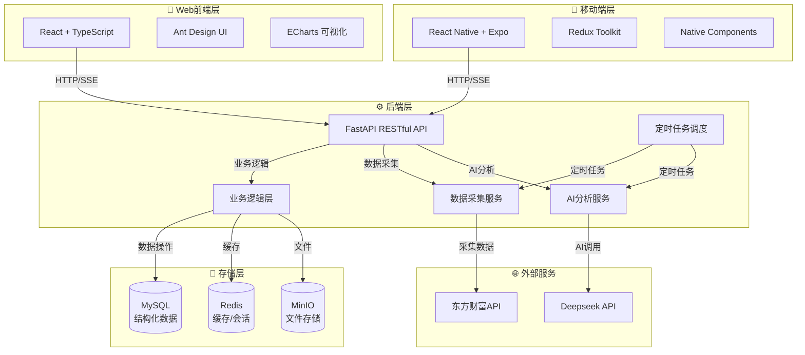
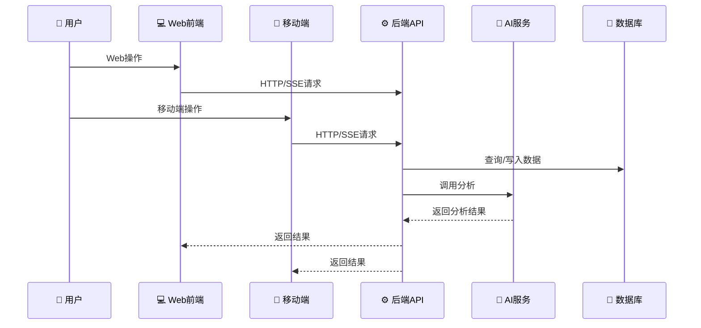

# 💹 金融智能数据采集与分析平台

<div align="center">


**🚀 企业级金融数据智能分析平台**
**📊 数据采集 + AI分析 + 可视化展示 + 权限管理**

[-green?style=for-the-badge&logo=android)](https://github.com/RedMoonnn/Financial_Android)

[](https://github.com/RedMoonnn/Financial_Program/stargazers)
[](https://github.com/RedMoonnn/Financial_Program/network)
[](https://github.com/RedMoonnn/Financial_Program/issues)
[](https://github.com/RedMoonnn/Financial_Program/blob/main/LICENSE)

</div>

---

## 📋 目录

- [🎯 项目简介](#项目简介)
- [✨ 核心功能](#核心功能)
- [🏗️ 系统架构](#系统架构)
- [🚀 快速开始](#快速开始)
- [⚙️ 环境配置](#环境配置)
- [📁 项目结构](#项目结构)
- [🔧 开发指南](#开发指南)
- [📚 API文档](#api文档)
- [🐛 常见问题](#常见问题)
- [🤝 贡献指南](#贡献指南)

---

## 🎯 项目简介

**金融智能数据采集与分析平台**是一套面向企业级金融数据需求的全流程解决方案，集成了**自动化数据采集**、**结构化存储**、**AI智能分析**、**可视化展示**和**权限管理**等功能。

### 主要特性

- 🔄 **自动化数据采集**：从东方财富网自动采集多市场、多周期、多分类的资金流数据
- 💾 **结构化存储**：MySQL存储结构化数据，MinIO存储报告文件，Redis缓存加速
- 🤖 **AI智能分析**：基于Deepseek大模型，提供专业的金融分析和投资建议
- 📊 **可视化展示**：ECharts图表展示，多维度数据筛选和分析
- 🔐 **权限管理**：完整的用户认证体系，支持管理员和普通用户角色
- 📄 **报告生成**：支持生成Markdown格式的分析报告，可下载和管理

### 应用场景

- 📈 股票资金流数据分析
- 🏢 企业投资决策支持
- 📊 金融市场数据监控
- 🤖 AI驱动的金融洞察

---

## ✨ 核心功能

### 📊 1. 数据采集模块

- **多维度采集**：支持股票资金流、板块资金流等多种类型
- **多市场支持**：全市场、沪深A股、创业板、科创板等
- **多周期覆盖**：今日、3日、5日、10日等不同周期
- **自动化任务**：支持定时采集和手动触发采集
- **数据管理**：采集任务状态跟踪，异常重试机制

### 🤖 2. AI智能分析

- **流式对话**：支持SSE流式输出，实时展示AI分析结果
- **上下文记忆**：支持多轮对话，保持上下文连贯性
- **专业分析**：生成结构化投资建议、风险提示、详细分析
- **报告生成**：一键生成Markdown格式的专业分析报告
- **历史管理**：报告历史记录，支持下载和删除

### 🎨 3. 数据可视化

- **多级Tab展示**：资金流类型 → 市场类型 → 周期 → 数据列表
- **动态图表**：ECharts图表展示资金流向趋势
- **数据筛选**：支持多维度筛选和排序
- **实时更新**：数据实时刷新，支持手动更新

### 🔐 4. 用户权限管理

- **用户注册**：邮箱注册，验证码验证
- **登录认证**：JWT Token认证，支持记住登录状态
- **密码找回**：邮箱验证码找回密码
- **权限分级**：管理员和普通用户权限分离
- **用户中心**：个人信息管理，报告查看

### 👨‍💼 5. 管理员功能

- **数据采集管理**：手动触发数据采集任务
- **用户管理**：查看和管理所有用户
- **报告管理**：查看和管理所有用户的报告
- **系统监控**：数据采集状态监控

### 📱 6. 移动端 (Android/iOS)

- **多端一致性**：基于 React Native (Expo) 构建，提供与 Web 端完全一致的功能体验。
- **随时随地分析**：支持通过手机与 AI 助手进行对话，查看最新的资金流向。
- **离线能力**：集成了本地缓存机制，确保在各种网络环境下都能顺畅使用。
- **管理员便捷操控**：支持在移动端直接下发采集指令，监控任务进度。

---

## 🏗️ 系统架构

### 技术栈

#### 🎨 前端技术栈
- **React 18** + **TypeScript**：现代化前端框架，类型安全
- **Ant Design 5**：企业级UI组件库
- **ECharts**：数据可视化图表库
- **Vite**：快速构建工具，优秀的开发体验
- **React Router**：单页应用路由管理
- **Axios**：HTTP客户端，统一API请求管理

#### ⚙️ 后端技术栈
- **FastAPI**：高性能Python Web框架，自动API文档
- **SQLAlchemy 2.0**：Python ORM框架
- **Pydantic**：数据验证和序列化
- **Uvicorn**：ASGI服务器，支持异步
- **APScheduler**：定时任务调度

#### 💾 存储技术栈
- **MySQL 8.0**：关系型数据库，存储结构化数据
- **Redis 6.2**：内存数据库，缓存和会话存储
- **MinIO**：对象存储，存储报告文件

#### 🤖 AI技术栈
- **Deepseek API**：大语言模型API，提供AI分析能力
- **OpenAI SDK**：统一的AI接口调用

#### 🐳 容器化
- **Docker**：容器化部署
- **Docker Compose**：多容器编排

#### 🛠️ 开发工具
- **Ruff**：Python代码检查和格式化
- **Pre-commit**：Git提交前代码检查
- **ESLint**：TypeScript代码检查

### 架构图



### 数据流程



---

## 🚀 快速开始

### 前置要求

- **Docker** >= 20.0 和 **Docker Compose**
- **Python** >= 3.8（本地开发）
- **Node.js** >= 16（本地开发）

### 一键启动（推荐）

```bash
# 1. 克隆项目
git clone https://github.com/RedMoonnn/Financial_Program.git
cd financial-program

# 2. 配置环境变量
cp .env.example .env
# 编辑 .env 文件，填入必要的配置（见下方环境配置章节）

# 3. 启动所有服务
docker-compose up --build -d

# 4. 查看服务状态
docker-compose ps

# 5. 查看日志
docker-compose logs -f
```

### 访问地址

启动成功后，访问以下地址：

- 🎨 **前端应用**：http://localhost:5173
- ⚙️ **后端API**：http://localhost:8000
- 📚 **API文档（Swagger）**：http://localhost:8000/docs
- 📚 **API文档（ReDoc）**：http://localhost:8000/redoc
- 📁 **MinIO控制台**：http://localhost:9001
- 🗄️ **MySQL**：localhost:3306
- ⚡ **Redis**：localhost:6379

### 首次使用

1. **注册账号**：访问前端，使用邮箱注册账号
2. **管理员账号**：系统会自动创建管理员账号（配置在`.env`中）
3. **数据采集**：使用管理员账号登录，进入"数据采集"页面手动触发采集
4. **查看数据**：在首页查看采集的资金流数据
5. **AI分析**：在"对话助手"页面与AI进行对话分析

---

## ⚙️ 环境配置

### 环境变量说明

项目使用`.env`文件管理环境变量，所有服务通过`env_file`配置自动加载。

**重要**：首次部署前，请复制`.env.example`为`.env`并修改配置：

```bash
cp .env.example .env
```

### 必需配置项

#### 🗄️ MySQL数据库配置
```ini
MYSQL_HOST=mysql              # Docker Compose中为服务名
MYSQL_PORT=3306
MYSQL_USER=root
MYSQL_PASSWORD=yourpassword   # 请修改为强密码
MYSQL_DATABASE=financial_web_crawler
```

#### ⚡ Redis配置
```ini
REDIS_HOST=redis              # Docker Compose中为服务名
REDIS_PORT=6379
REDIS_DB=0
REDIS_PASSWORD=yourredispassword  # 请修改为强密码
```

#### 📁 MinIO对象存储配置
```ini
MINIO_ENDPOINT=minio:9000     # Docker Compose中为服务名
MINIO_PUBLIC_ENDPOINT=localhost:9000  # 外部访问地址
MINIO_ACCESS_KEY=admin        # 请修改
MINIO_SECRET_KEY=admin123     # 请修改为强密码
MINIO_BUCKET=data-financial-agent
MINIO_SECURE=False
```

#### 🤖 Deepseek AI配置
```ini
DEEPSEEK_API_KEY=your_deepseek_api_key  # 必填，从Deepseek官网获取
DEEPSEEK_BASE_URL=https://api.deepseek.com
```

#### 🔑 JWT认证配置
```ini
JWT_SECRET=your_jwt_secret_key  # 必填，请使用随机字符串
```

#### 👨‍💼 管理员账号配置（首次启动自动创建）
```ini
ADMIN_EMAIL=admin@example.com      # 管理员邮箱
ADMIN_PASSWORD=your_secure_password # 管理员密码
ADMIN_USERNAME=admin                # 管理员用户名
```

#### 📧 SMTP邮箱配置（用于发送验证码）
```ini
SMTP_SERVER=smtp.qq.com
SMTP_PORT=587
SMTP_USER=your_email@qq.com
SMTP_PASSWORD=your_email_auth_code  # 邮箱授权码，非登录密码
```

#### 📝 日志配置（可选）
```ini
LOG_LEVEL=INFO    # DEBUG/INFO/WARNING/ERROR
LOG_FILE=None     # 日志文件路径，None表示输出到控制台
```

#### 🎨 前端配置（可选）
```ini
VITE_API_TARGET=http://backend:8000  # 前端API目标地址
```

### 配置说明

- **Docker Compose环境**：服务间通信使用服务名（如`mysql`、`redis`），外部访问使用`localhost`
- **本地开发环境**：需要修改`MYSQL_HOST`、`REDIS_HOST`等为`localhost`
- **生产环境**：建议使用环境变量管理工具（如Vault）或Docker Secrets

### 详细配置文档

- 📖 [管理员配置指南](./docs/admin_config_guide.md)
- 📖 [SMTP配置指南](./docs/smtp_config_guide.md)
- 📖 [Docker Compose部署指南](./docs/docker_compose_guide.md)
- 📖 [服务端口说明](./docs/service_ports_guide.md)

---

## 📁 项目结构

```
📦 Financial_Program/
├── 🐍 backend/                    # FastAPI后端
│   ├── 📡 api/                    # API接口层
│   │   ├── middleware.py          # API中间件（异常处理、日志）
│   │   └── v1/                    # API v1版本
│   │       ├── router.py          # 路由聚合
│   │       └── endpoints/          # API端点模块
│   │           ├── ai.py          # AI分析接口
│   │           ├── auth.py        # 认证接口（登录/注册/找回密码）
│   │           ├── collect.py     # 数据采集接口
│   │           ├── data.py        # 数据状态接口
│   │           ├── flow.py        # 资金流查询接口
│   │           ├── health.py      # 健康检查接口
│   │           └── report.py      # 报告管理接口
│   ├── 🚀 app/                    # 应用入口
│   │   └── main.py                # FastAPI应用主文件，生命周期管理
│   ├── ⚙️ core/                   # 核心模块
│   │   ├── config.py              # 配置管理（环境变量读取）
│   │   ├── database.py            # 数据库连接（SQLAlchemy）
│   │   ├── cache.py               # Redis缓存封装
│   │   ├── logging.py             # 日志配置
│   │   └── storage.py             # MinIO对象存储封装
│   ├── 🕷️ crawler/                # 爬虫采集模块
│   │   └── crawler.py             # 东方财富数据采集逻辑
│   ├── ⚙️ services/               # 业务逻辑层
│   │   ├── ai/                    # AI服务
│   │   │   ├── deepseek.py        # Deepseek API封装
│   │   │   └── report.py          # 报告生成服务
│   │   ├── auth/                  # 认证服务
│   │   │   ├── user_service.py    # 用户管理服务
│   │   │   └── email_service.py   # 邮箱验证服务
│   │   ├── common/                # 通用服务
│   │   │   ├── cache_service.py   # 缓存服务
│   │   │   ├── chat_service.py    # 聊天历史服务
│   │   │   └── task_service.py    # 任务管理服务
│   │   ├── flow/                  # 资金流服务
│   │   │   ├── flow_data_query.py # 数据查询服务
│   │   │   ├── flow_data_service.py # 数据服务
│   │   │   └── flow_image_service.py # 图片服务
│   │   ├── report/                # 报告服务
│   │   │   └── report_service.py  # 报告管理服务
│   │   ├── init_db.py             # 数据库初始化（表创建、管理员创建）
│   │   └── scheduler.py           # 定时任务调度（APScheduler）
│   ├── 🗃️ models/                 # ORM模型
│   │   └── models.py              # 数据模型定义（User/FlowData/Report等）
│   ├── 📋 schemas/                 # 数据验证模式（Pydantic）
│   ├── 🧪 tests/                  # 测试模块
│   ├── 🛠️ utils/                   # 工具函数
│   ├── 📋 requirements.txt        # Python依赖
│   ├── 🐳 Dockerfile              # Docker镜像构建
│   └── 🚀 run.py                  # 应用启动脚本
│
├── ⚛️ frontend/                   # React前端
│   ├── 📂 src/
│   │   ├── 📄 pages/              # 页面组件
│   │   │   ├── Home.tsx           # 首页（资金流数据展示）
│   │   │   ├── Chat.tsx           # AI对话助手
│   │   │   ├── Reports.tsx        # 历史报告列表
│   │   │   ├── UserCenter.tsx     # 用户中心
│   │   │   ├── Login.tsx          # 登录页面
│   │   │   ├── Register.tsx       # 注册页面
│   │   │   ├── Forgot.tsx         # 找回密码
│   │   │   ├── AdminCollect.tsx   # 管理员-数据采集
│   │   │   ├── AdminReports.tsx   # 管理员-报告管理
│   │   │   └── AdminUsers.tsx     # 管理员-用户管理
│   │   ├── 🪝 hooks/              # React Hooks
│   │   │   ├── useCollect.ts      # 数据采集Hook
│   │   │   ├── useReports.ts      # 报告管理Hook
│   │   │   └── useUsers.ts        # 用户管理Hook
│   │   ├── 🗃️ types/              # TypeScript类型定义
│   │   ├── 🛠️ utils/              # 工具函数
│   │   │   ├── apiUtils.ts        # API请求封装
│   │   │   ├── dateUtils.ts       # 日期工具
│   │   │   ├── errorHandler.ts    # 错误处理
│   │   │   └── sortUtils.ts       # 排序工具
│   │   ├── 🔐 auth.ts             # 认证工具（Token管理）
│   │   ├── 🎯 App.tsx             # 应用主组件（路由、布局）
│   │   └── 🚀 main.tsx            # 入口文件
│   ├── 📦 package.json            # 前端依赖
│   ├── 🐳 Dockerfile             # Docker镜像构建
│   └── ⚙️ vite.config.js         # Vite配置
│
├── 📚 docs/                       # 文档目录
│   ├── admin_config_guide.md      # 管理员配置指南
│   ├── docker_compose_guide.md    # Docker Compose部署指南
│   ├── docker_image_publish_guide.md # Docker镜像发布指南
│   ├── node_npm_nvm_guide.md      # Node.js环境配置指南
│   ├── service_ports_guide.md    # 服务端口说明
│   └── smtp_config_guide.md       # SMTP配置指南
│
├── 🔧 scripts/                    # 脚本目录
│   ├── init-mysql.sh              # MySQL初始化脚本
│   ├── setup-mysql-user.sh        # MySQL用户设置脚本
│   └── pre-commit.sh              # Pre-commit钩子脚本
│
├── 💾 data/                       # 数据持久化目录（Docker卷挂载）
│   ├── mysql/                     # MySQL数据目录
│   ├── redis/                     # Redis数据目录
│   └── minio/                     # MinIO数据目录
│
├── 🐳 docker-compose.yml          # Docker Compose编排配置
├── ⚙️ .env.example                # 环境变量模板
├── 🔧 .pre-commit-config.yaml     # Pre-commit配置
├── 🔧 ruff.toml                   # Ruff代码检查配置
├── 📄 my.cnf                      # MySQL配置文件
├── 📄 redis.conf                  # Redis配置文件
└── 📖 README.md                   # 项目文档（本文件）
```

---

## 🔧 开发指南

### 本地开发环境搭建

#### 1. 后端开发

```bash
# 进入后端目录
cd backend

# 创建虚拟环境（推荐）
python3 -m venv .venv
source .venv/bin/activate  # Linux/Mac
# 或 .venv\Scripts\activate  # Windows

# 安装依赖
pip install -r requirements.txt

# 启动开发服务器（自动重载）
python run.py
# 或使用 uvicorn
# uvicorn app.main:app --host 0.0.0.0 --port 8000 --reload
```

#### 2. 前端开发

```bash
# 进入前端目录
cd frontend

# 安装依赖
npm install

# 启动开发服务器
npm run dev

# 构建生产版本
npm run build
```

#### 3. 数据库服务（使用Docker）

```bash
# 在项目根目录启动数据库服务（MySQL、Redis、MinIO）
docker-compose up -d mysql redis minio

# 查看服务状态
docker-compose ps
```

**注意**：本地开发时，需要修改`.env`文件中的`MYSQL_HOST`、`REDIS_HOST`等为`localhost`。

### 代码质量工具

#### Pre-commit 钩子

```bash
# 安装 pre-commit 钩子
pre-commit install

# 手动运行所有检查
pre-commit run --all-files

# 跳过钩子提交（不推荐）
git commit --no-verify
```

#### Ruff 代码检查（Python）

```bash
# 检查代码问题
ruff check backend/

# 自动修复代码问题
ruff check --fix backend/

# 格式化代码
ruff format backend/
```

#### ESLint 代码检查（TypeScript）

```bash
# 检查代码问题
cd frontend && npm run lint

# 自动修复代码问题
npm run lint:fix
```

### 代码规范

- **Python**：遵循PEP 8规范，使用Ruff自动检查和格式化
- **TypeScript**：遵循ESLint规则，使用Prettier格式化
- **提交前检查**：自动运行pre-commit钩子进行代码检查

---

## 📚 API文档

### API基础信息

- **Base URL**：`http://localhost:8000/api/v1`
- **API文档**：http://localhost:8000/docs（Swagger UI）
- **API文档**：http://localhost:8000/redoc（ReDoc）

### 主要API端点

#### 🔐 认证相关
- `POST /api/v1/auth/register` - 用户注册
- `POST /api/v1/auth/login` - 用户登录
- `POST /api/v1/auth/forgot` - 找回密码
- `GET /api/v1/auth/user` - 获取当前用户信息

#### 📊 数据查询
- `GET /api/v1/flow` - 查询资金流数据
  - 参数：`flow_type`、`market_type`、`period`、`limit`
- `GET /api/v1/data/status` - 获取数据采集状态

#### 🤖 AI分析
- `POST /api/v1/ai/advice` - AI分析建议（流式输出）
  - 参数：`message`、`flow_type`、`market_type`、`period`、`style`
- `POST /api/v1/ai/report` - 生成分析报告
  - 参数：`table_name`、`chat_history`

#### 📄 报告管理
- `GET /api/v1/report/minio_list` - 获取报告列表
- `GET /api/v1/report/download` - 下载报告
- `DELETE /api/v1/report/delete` - 删除报告

#### 🔄 数据采集（管理员）
- `POST /api/v1/collect/collect_v2` - 触发数据采集
  - 参数：`flow_choice`、`market_choice`、`detail_choice`、`day_choice`、`pages`

#### ❤️ 健康检查
- `GET /api/v1/health` - 服务健康检查

### API使用示例

#### 用户登录
```bash
curl -X POST "http://localhost:8000/api/v1/auth/login" \
  -H "Content-Type: application/json" \
  -d '{
    "email": "user@example.com",
    "password": "password123"
  }'
```

#### 查询资金流数据
```bash
curl -X GET "http://localhost:8000/api/v1/flow?flow_type=Stock_Flow&market_type=All_Stocks&period=Today&limit=100" \
  -H "Authorization: Bearer YOUR_TOKEN"
```

#### AI分析（流式输出）
```bash
curl -X POST "http://localhost:8000/api/v1/ai/advice" \
  -H "Content-Type: application/json" \
  -H "Authorization: Bearer YOUR_TOKEN" \
  -d '{
    "message": "分析今日资金流向",
    "flow_type": "Stock_Flow",
    "market_type": "All_Stocks",
    "period": "Today",
    "style": "专业"
  }'
```

---

## 🐛 常见问题

### 部署问题

| 问题 | 解决方案 |
|------|----------|
| 🔌 **端口冲突** | 确保5173、8000、3306、9000、9001、6379端口未被占用，或修改`docker-compose.yml`中的端口映射 |
| 💾 **数据丢失** | 确保`data/`目录已正确挂载，容器重启不会丢失数据 |
| ⚙️ **配置错误** | 检查`.env`文件配置是否正确，特别是服务名和密码 |
| 🐳 **Docker启动失败** | 检查Docker和Docker Compose版本，确保满足要求 |
| 📦 **依赖安装失败** | 确保Python版本>=3.8，Node.js版本>=16 |

### 功能问题

| 问题 | 解决方案 |
|------|----------|
| 🤖 **AI分析异常** | 检查Deepseek API Key是否正确，网络是否连通，账户余额是否充足 |
| 🔐 **认证失败** | 确认Redis密码、JWT_SECRET配置正确，Token是否过期 |
| 📊 **数据查询为空** | 确认已执行数据采集，检查数据库连接和表是否存在 |
| 📧 **邮箱验证码收不到** | 检查SMTP配置是否正确，邮箱授权码（非登录密码）是否正确 |
| 🕷️ **数据采集失败** | 检查网络连接，东方财富API是否可访问，采集参数是否正确 |

### 开发问题

| 问题 | 解决方案 |
|------|----------|
| 🐛 **Pre-commit失败** | 运行`pre-commit run --all-files`查看详细错误，修复后重新提交 |
| 📝 **代码格式化问题** | 运行`ruff format backend/`自动格式化Python代码 |
| 🔍 **TypeScript类型错误** | 运行`npm run lint`检查类型错误，修复后重新编译 |
| 🔄 **热重载不工作** | 检查文件监听配置，确保文件权限正确 |

### 日志排查

```bash
# 查看所有服务日志
docker-compose logs -f

# 查看特定服务日志
docker-compose logs -f backend
docker-compose logs -f frontend
docker-compose logs -f mysql

# 查看最近100行日志
docker-compose logs --tail=100 backend

# 查看错误日志
docker-compose logs backend | grep ERROR
```

### 维护命令

```bash
# 重启服务
docker-compose restart [service_name]

# 停止所有服务
docker-compose down

# 停止并删除数据卷（⚠️ 会删除数据）
docker-compose down -v

# 重新构建并启动
docker-compose up --build -d

# 备份MySQL数据
docker exec mysql mysqldump -u root -p financial_web_crawler > backup.sql

# 恢复MySQL数据
docker exec -i mysql mysql -u root -p financial_web_crawler < backup.sql
```

---

## 🤝 贡献指南

### 贡献方式

1. **🐛 报告Bug**：在GitHub Issues中提交详细的问题描述
2. **💡 功能建议**：欢迎提出新功能和改进建议
3. **📝 代码贡献**：Fork项目，创建功能分支，提交PR
4. **📖 文档改进**：帮助完善文档和注释

### 开发流程

```bash
# 1. Fork并克隆项目
git clone https://github.com/your-username/financial-program.git
cd financial-program

# 2. 创建功能分支
git checkout -b feature/your-feature-name

# 3. 安装开发依赖
cd backend && pip install -r requirements.txt
pre-commit install
cd ../frontend && npm install

# 4. 开发并测试
# ... 编写代码 ...

# 5. 提交代码（会自动运行pre-commit检查）
git add .
git commit -m "feat: 添加新功能"

# 6. 推送并创建PR
git push origin feature/your-feature-name
```

### 代码规范

- 遵循项目的代码风格和规范
- 确保代码通过pre-commit检查
- 添加必要的注释和文档
- 编写测试用例（如适用）

### 学习资源

- 📚 [React官方文档](https://react.dev/)
- 📚 [FastAPI官方文档](https://fastapi.tiangolo.com/)
- 📚 [TypeScript官方文档](https://www.typescriptlang.org/)
- 📚 [Docker官方文档](https://docs.docker.com/)
- 📚 [Ruff官方文档](https://docs.astral.sh/ruff/)
- 📚 [Pre-commit官方文档](https://pre-commit.com/)
- 📚 [SQLAlchemy官方文档](https://docs.sqlalchemy.org/)

---

## 📞 联系我们

- 📧 **Email**：3188018553@qq.com
- 💬 **QQ群**：3188018553

---

<div align="center">

**💹 智能金融数据采集分析平台**
**🚀 助力企业级数据驱动决策，AI赋能金融洞察**

[](https://github.com/RedMoonnn/Financial_Program/stargazers)
[](https://github.com/RedMoonnn/Financial_Program/network)

**⭐ 如果这个项目对你有帮助，请给我们一个Star！**

</div>
